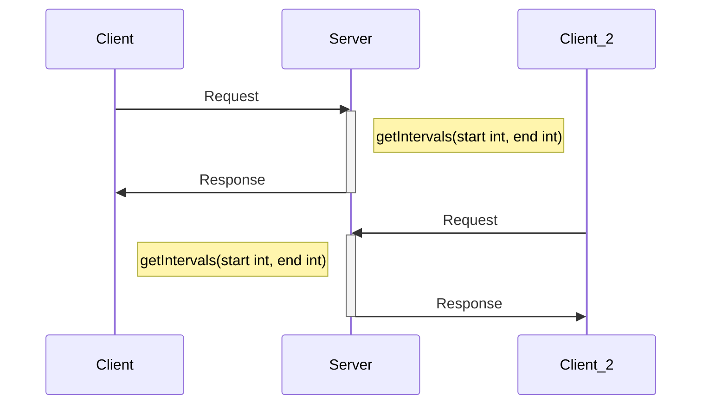
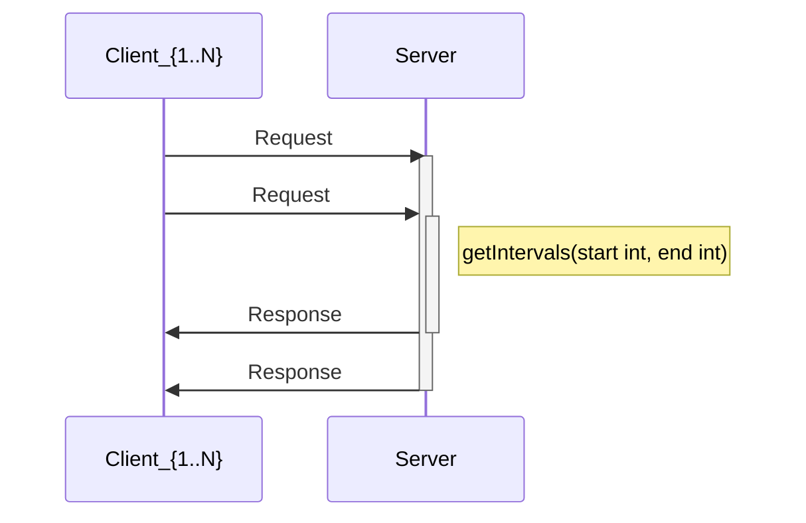
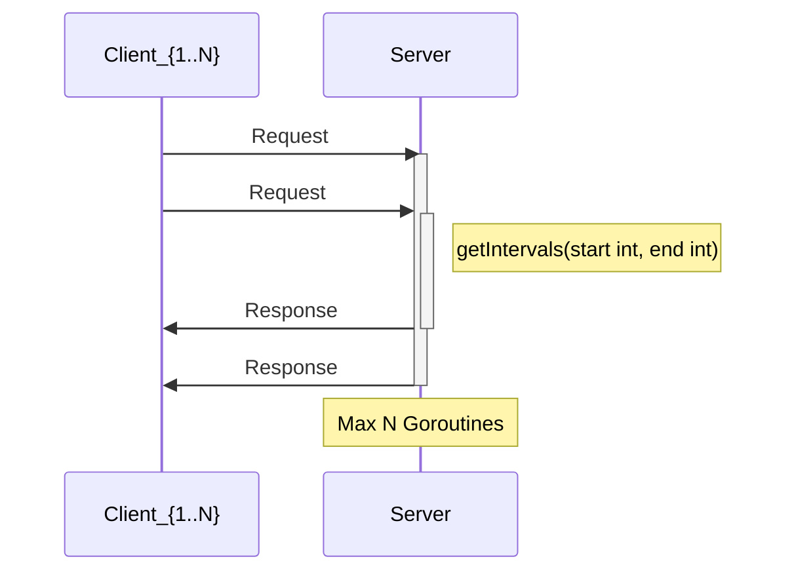
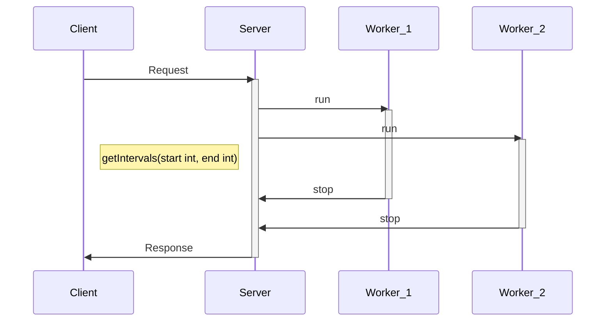

# sisdis-pr-1
Aplicación distribuida de cálculo de número primos

## Run

Cliente

```bash
go run client.go 155.210.154.198 5000
```

Master

```bash
go run master.go tcp 155.210.154.198 5000
```

Workers

```bash
go run worker.go tcp 155.210.154.199 5001
go run worker.go tcp 155.210.154.199 5002
go run worker.go tcp 155.210.154.199 5003
go run worker.go tcp 155.210.154.199 5004
go run worker.go tcp 155.210.154.199 5005
go run worker.go tcp 155.210.154.199 5006
```

## cliente-servidor secuencial



## cliente servidor concurrente

### Sin pool fijo



### Con pool fijo



## master-worker

